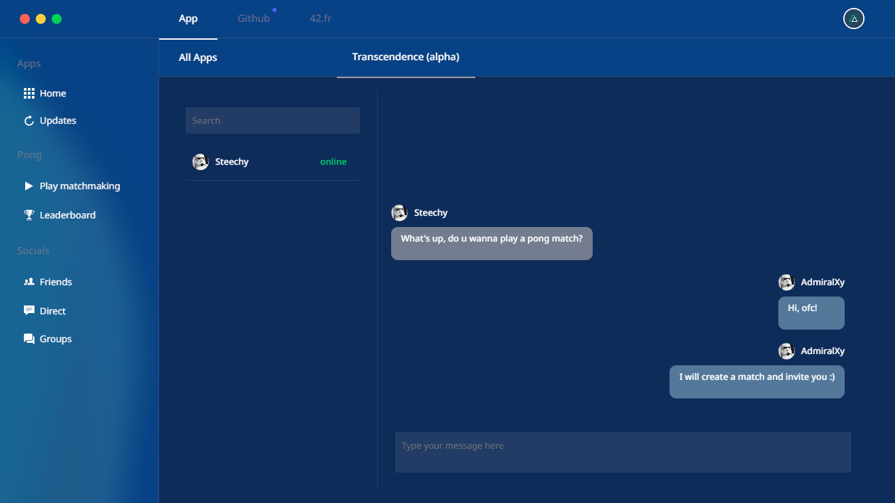

<h1 align="center">ft_transcendence</h1>
<p align="center">Real-time multiplayer Pong game website.</p>

<p align="center">
	
	
</p>

<br/><br/>

<p align="center"><a href="https://github.com/AdmiralXy/42ft_transcendence"></a></p>

<br/>

## :ledger:  Technology stack

* **Docker containers**
  * Development with hot-reloads and production modes
  * Backend
  * Frontend
  * Database
  * Nginx webserver
* **Backend**
  * Service-oriented architecture
  * NestJS
  * Socket.io server
  * TypeScript
  * PostgreSQL
* **Frontend**
  * State management design with centralized store for all the components
  * NuxtJS with TypeScript
    * VueJS
    * Vuex
    * Vue Router
  * Socket.io client
  * BootstrapVue
  * SCSS

## :ledger:  Features

* **Authentication**
  * Google/42.fr OAuth2
  * Two-factor authentication with QR codes
* **User**
  * Set unique username
  * Upload avatar
  * View own and other people's profile with stats and latest matches
  * Status: online, offline, in game, chatting, in matchmaking queue
* **Pong game**
  * Real-time multiplayer using WebSockets
  * Classic and modern themes
  * Angle-based ball movement
  * Training mode with AI opponent
  * Server-side state protection
  * Matches history and statistics
  * Ability to connect as a spectator, watch a live play between other users without interfering with it
  * Network lag will not disconnect the client, the current state will reach the client as soon as the connection is stable
* **Matchmaking system**
  * Automatic matchmaking queue based on player's rating level
* **Leaderboard**
  * List of top-rated players
* **Friends**
  * Send friend requests
  * Accept friend requests
  * Remove friend
* **Direct chat messaging**
  * Real-time receiving and sending using WebSockets
  * Database-based with chat history
  * Send private messages to your friends
  * Read private messages from your friends
* **Blacklist**
  * Add user to your blacklist
  * Remove user from your blacklist
  * Blacklisted users are not able to chat with you
  * You will not see blacklisted users in your friends list
* **Groups**
  * Client-based chat history, cleared when client disconnects
  * Create and manage groups with 3 different modes:
    * Public: anyone can join and chat
    * Protected: you need to provide a password to join
    * Invite-only: only invited members can join 
  * Different user roles:
    * Default:
      * View user list
      * Invite other users to play a private pong match
      * Send messages in group chat
      * Read messages from group chat
    * Administrator:
      * Default privileges
      * Add users to invite-list
      * Ban user for limited or permanent time
      * Mute user for limited or permanent time
    * Owner:
      * Default and administrator privileges
      * Change group mode to public, protected or invite-only
      * Set or change a group password
      * Give or remove administrator privileges
      * Delete group

## :zap:  Quick start

**Step 1:** Make sure you have Docker, Docker-compose and Makefile installed

**Step 2:** Create .env file in the root directory of project and configure it, see the .env.example file for more information

**Step 3:** Run `make dev` to build the project in development mode, open the browser and go to http://localhost/ if you are using local environment

**Makefile endpoints:**

```JavaScript
// Start the containers for development
$> make dev

// Start the containers in production mode
$> make prod

// Stop the containers
$> make stop

// List available containers, images, networks and volumes
$> make list

// Clean builded containers, images, networks and volumes
$> make clean

// Clean builded containers, images, networks, volumes and cache
$> make fclean
```

<br/>

## :tada:  Examples

**Profile page**


<br/><br/>

**Direct chat**



<br/><br/>

**Pong game**


<br/><br/>

**Game results**


<br/><br/>